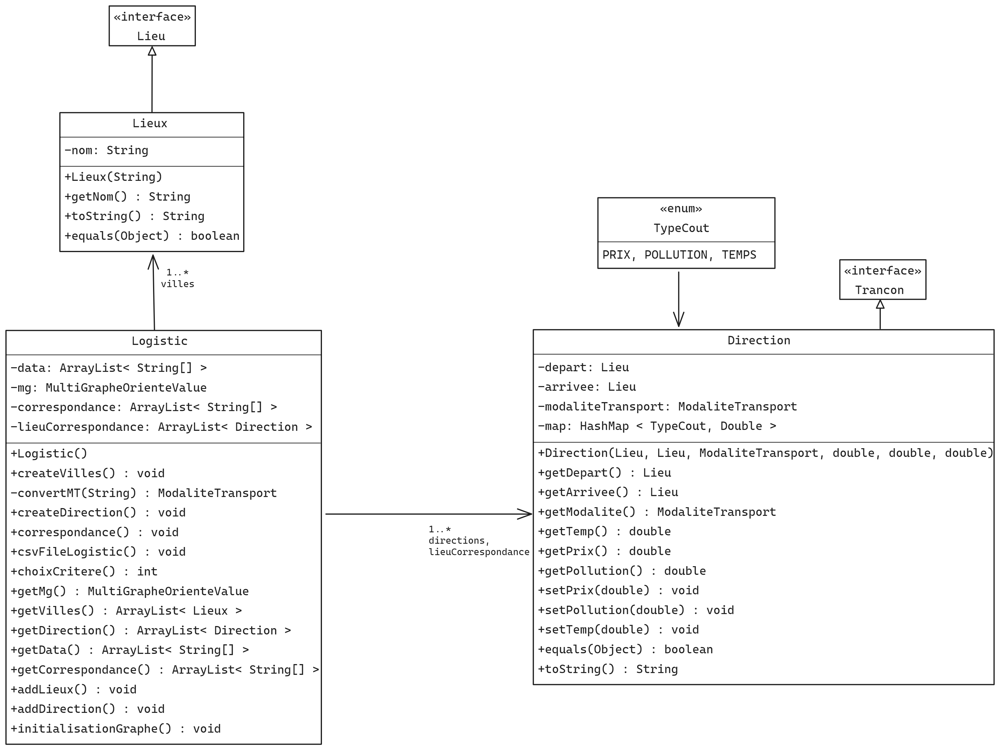
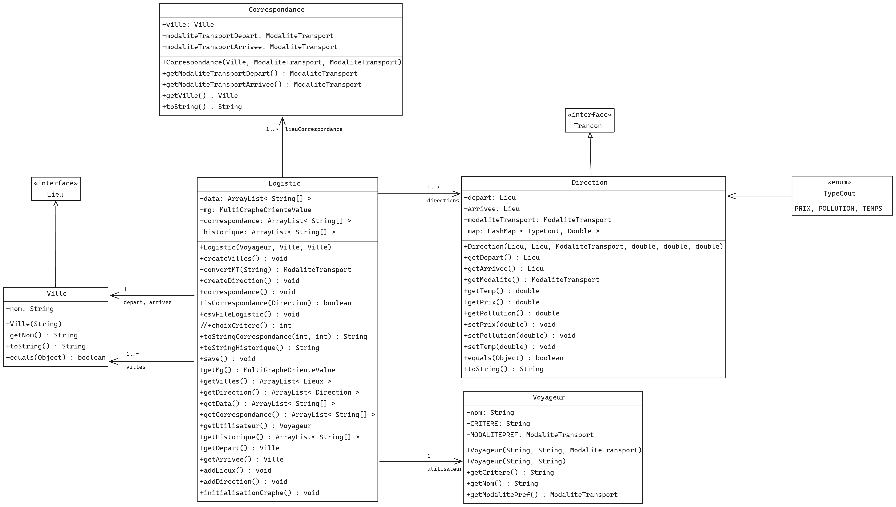
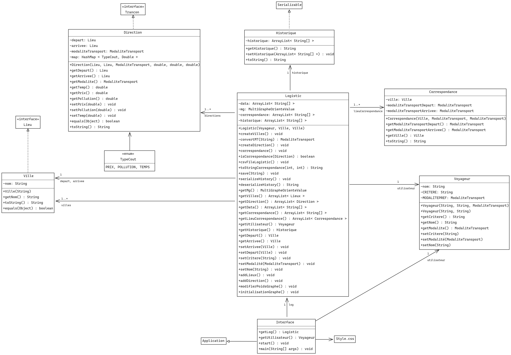

# Dev-oo
### Version 1
- Comment lancer le l'application :
```
On peut compiler l'application grâce à ./compile.sh
Puis le lancer grâce à ./run.sh
```
-  Diagramme UML +  réflexion sur les mécanismes objets :

```
Pour nous, le choix s'est porté sur une encapsulation des deux méthodes Direction, Lieux et TypeCout.
Lieux hérite de Lieu.
Direction hérite de Trancon.
```
- une analyse technique et critique de l’implémentation des fonctionnalités demandées :
```
On a décidé à la création initiale de toutes les classes de base permettant la création de Direction et de Lieux en les mettant directement dans une arraylist cela permet de créer des méthodes de création et de récupérer juste ce qui nous intéresses pour le mettre ensuite dans le multigraphe.
Quelque méthode permettant de convertir un String en modalité de transport.
La création de getter et de setter.
```
- une analyse quantitative/qualitative des tests que vous avez réalisé :
```
Les tests se trouvant dans LogisticTest permettent de tester toutes les méthodes mise en place et permet de vérifier le bon fonctionnement de celle-ci.
Avec l'ajout d'un UseLogistic qui permet de tester avec directement avec des toString.
```
### Version 2
- Comment lancer le l'application :
```
On peut compiler l'application grâce à ./compile.sh
Puis le lancer grâce à ./run.sh
```
-  Diagramme UML +  réflexion sur les mécanismes objets :

```
Encapsulation d'un voyageur mais aussi encapsulation d'une arraylist de Correspondance
```
- une analyse technique et critique de l’implémentation des fonctionnalités demandées :
```
On a décidé à la création d'une classe Voyageur pour permettre à l'utilisateur d'avoir un nom avec son critère et son moyen transport préféré. 
Mais aussi la création d'une arraylist de correspondance pour ventiler des données pour permettre une meilleure visibilité du code et cela permet de définir ce qu'est une correspondance.
Mise en place de l'incorporation de donnée avec le csv.
Mise en place d'un départ et arrivé pour permettre d'utiliser l'algorithm directement dans logistic.
```
- une analyse quantitative/qualitative des tests que vous avez réalisé :
```
Quelque test on était effectuer avec LogisticTest surtout avec la l'utilisation des csvs mais le plus gros des tests se sont fait avec le UseLogistic qui permetter d'utiliser toutes les méthodes et de voire leur bon fonctionnement.
```
### Version 3
- Comment lancer le l'application :
```
juste avec ./run.sh
java -jar devoo_projet.jar // probléme avec le package sae_s2_2024.jar
```
-  Diagramme UML +  réflexion sur les mécanismes objets :

```
Encapsulation de Logistic dans interface.
Interface qui hérite de Application.
```
- une analyse technique et critique de l’implémentation des fonctionnalités demandées :
```
Quelque changement on été effectuer pour la bonne implémentation dans l'interface pour permettre son bon fonctionnement notamment dans le toStringCorrespondance mais aussi dans certaines méthodes. 
Mise en place d'une serialiation avec la création de la classe Historique.
Mise en place d'une save de l'histoique.
```
- une analyse quantitative/qualitative des tests que vous avez réalisé :
```
Tous les tests, on était effectué dans le UseLogistic notamment pour la save et la sérialisation se trouvant dans historique.ser et la save se trouvant dans save.csv
```