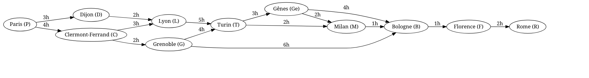
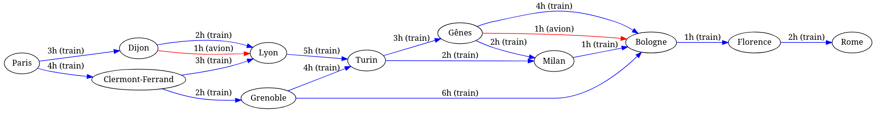

SAE S2.02 -- Rapport pour la ressource Graphes
===

*LAMOUR Enzo, WILFART Axel, GUISLIN Thomas*

Version 1 : un seul moyen de transport
---

### Présentation d'un exemple

On souhaite voyager de Paris à Rome en passant par plusieurs villes pour toutes les visiter.

Sommets: Paris (P), Dijon (D), Clermont-Ferrand (C), Lyon (L), Grenoble (G), Turin (T), Bologne (B), Gênes (Ge), Milan (M), Florence (F) et Rome (R)
Arêtes: P-D, P-C, 
D-L, D-L, 
C-L, C-G, 
L-T, 
G-T, G-B, 
T-M, T-Ge, 
B-F, 
Ge-M, Ge-B, 
M-B,
F-R,
Poids: temps de trajet entre chaque paire de villes
Problème: Trouver le chemin le plus court entre Paris et Rome.

### Modèle pour l'exemple


le meilleurs itinéraire est P-D-L-T-M-R

Paris-Dijon-Lyon-Turin-Milan-Rome

### Modélisation pour la Version 1 dans le cas général

```
On peut faire en sorte que chaque arête soit munie de son moyen de transport.
On peut aussi optimiser les voyages selon des critères.
Et pour finir, l'utilisation d'algorithme permet de calculer le plus court chemin.
```

- sommets: Paris (P), Dijon (D), Clermont-Ferrand (C), Lyon (L), Grenoble (G), Turin (T), Bologne (B), Gênes (Ge), Milan (M), Florence (F) et Rome (R), 
- Arêtes: P-D, P-C, 
D-L, D-L, 
C-L, C-G, 
L-T, 
G-T, G-B, 
T-M, T-Ge, 
B-F, 
Ge-M, Ge-B, 
M-B,
F-R,, 
- Poids : temps de trajet entre chaque paire de villes,
- Dijkstra permet de résoudre ce probléme car il permet de savoir le plus court chemin sur des noeuds orientés

### Implémentation de la Version 1

LogisticTest.java, "Correction de la méthode correspondance avec l'ajout d'une classe correspondance + ajout de toString", https://gitlab.univ-lille.fr/sae2.01-2.02/2024/A4/-/blob/main/test/LogisticTest.java?ref_type=heads

Version 2 : multimodalité et prise en compte des correspondances
---

### Présentation d'un exemple

- sommets: Paris (P), Dijon (D), Clermont-Ferrand (C), Lyon (L), Grenoble (G), Turin (T), Bologne (B), Gênes (Ge), Milan (M), Florence (F) et Rome (R), 
- Arêtes: 
```
P-D/train, P-C/train, 
D-L/train, D-L/Avion 
C-L/train, C-G/train, 
L-T/train, 
G-T/train, G-B/train, 
T-M/train, T-Ge/train, 
B-F/train, 
Ge-M/train, Ge-B/train, Ge-B/Avion
M-B/train,
F-R/train,
```
- Poids : temps de trajet entre chaque paire de villes,
- Coûts de correspondance:
```
Correspondance entre le train et l'avion: 1 heure supplémentaire.
Correspondance entre deux trains ou deux avions: 0.5 heure supplémentaire.
```
- S'il y a aucun poids négatif l'algorithme de Dijkstra sera l'algorithme le plus optimisé pour ce graphe sinon l'algortihme de Bellman s'il y a des poids négatifs


### Modèle pour l'exemple



Le meilleur itinéraire est P/train-D/Avion-L/train-T/train-M/train-R/train.

### Modélisation pour la Version 2 dans le cas général
```
Pour résoudre ce problème, on a créée une méthode correspondance qui permet de modifier directement les directions par rapport au dataCorrespondance.csv (données). 

Il recherche des correspondances entre le csv et dans l'array list de direction tout en vérifiant si l'arrivée et aussi un départ dans une autre ligne puis il vérifie ainsi la mobilité.
```
### Implémentation de la Version 2

LogisticTest.java, 01/06/24, https://gitlab.univ-lille.fr/sae2.01-2.02/2024/A4/-/commit/f49f0b427c3a139b54fcd62f46c626d49c3b5551


Version 3 : optimisation multi-critères
---

### Présentation d'un exemple

- sommets: Paris (P), Dijon (D), Clermont-Ferrand (C), Lyon (L), Grenoble (G), Turin (T), Bologne (B), Gênes (Ge), Milan (M), Florence (F) et Rome (R), 
- Arêtes :
```
P-D (train) : (2h, 50€, 10kg), P-C (train) : (3h, 70€, 15kg), 
D-L (train) : (1.5h, 30€, 7kg), D-L (avion) : (1h, 100€, 50kg) 
C-L (train) : (2h, 40€, 9kg), C-G (train) : (2.5h, 60€, 12kg), 
L-T (train) : (2.5h, 80€, 18kg), 
G-T (train) : (1h, 20€, 5kg), G-B (train) : (2h, 70€, 14kg), 
T-M (train) : (1.5h, 50€, 10kg),T-Ge (train) : (2h, 60€, 12kg), 
B-F (train) : (2.5h, 90€, 20kg), 
Ge-M (train) : (1.5h, 50€, 10kg), Ge-B (train) : (2h, 70€, 14kg), Ge-B (avion) : (1h, 150€, 60kg)
M-B (train) : (1.5h, 50€, 10kg),
F-R (train) : (3h, 100€, 25kg),
```
- Poids : temps de trajet en heures, coût en euros, empreinte carbone en kg CO2,
- Coûts de correspondance:
```
Correspondance entre train et avion: (1h, 10€, 5kg)
Correspondance entre deux trains ou deux avions: (0.5h, 5€, 2kg)
```
- Dijkstra permet de résoudre ce problème car il permet de savoir le plus court chemin sur des noeuds orientés avec plusieurs critéres

### Modèle pour l'exemple


- Ce graphe sera répété avec les différents coüt, mais les lignes ne changent pas. 

Le meilleur itinéraire est P/train-D/Avion-L/train-T/train-M/train-R/train pour chaque critère.

### Modélisation pour la Version 3 dans le cas général
```
Pour le multicritère, on a choisi d'utiliser des tableaux donc tab1, tab2 etc... pour permettre de comparer plusieurs critères et permettre donc à l'utilisateur d'utiliser le critère qui lui correspond le mieux.
L'exemple de ce multicritère se trouve dans la maquette de notre IHM. Pour que ce soit plus lisible, on aurait coupé en deux l'interface pour permettre de mettre par exemple tab1 dans le coin gauche et tab2 dans le coin droit.
```

### Implémentation de la Version 3

UseLogistic.java, 19/06/24, https://gitlab.univ-lille.fr/sae2.01-2.02/2024/A4/-/commit/07b912c9a97ff341f59916e5cf2b97ac6e9d0929
----------------------------------------------------

**Fin du rapport**

### Barème sur 30 pts

Toute question sur le barème est à adresser à iovka.boneva@univ-lille.fr


- Rapport non rendu à temps -> note 0 
- **(7, décomposé comme suit)** Divers
  - **(1,5)** Respect de la structure du rapport
  - **(1,5)** Section Version 1 rendue pour le 18/05/2024. Cette version peut contenir les parties en italique.
  - **(1,5)** Section Version 2 rendue pour le 08/06/2024. Cette version peut contenir les parties en italique.
  - **(1)** Utilisation de vocabulaire précis sur les graphes (termes vu en cours, noms des algorithmes, etc.)
  - **(1,5)** Style d'écriture fluide et compréhensible

- **(8, décomposé comme suit)** Solution pour la Version 1
  - **(2)** Exemple pertinent (illustre tous les aspects du problème) et lisible (en particulier, ni trop grand ni trop petit, bien présenté)
  - **(4)** Le modèle de l'exemple permet de trouver la solution sur l'exemple. La modélisation pour le cas général permet de résoudre le problème posé
  - **(2)** L'implémentation de l'exemple est correcte et fonctionnelle

- **(6, décomposé comme suit)** Solution pour la Version 2
  - **(1)** Exemple pertinent
  - **(4)** le modèle de l'exemple permet de trouver la solution sur l'exemple. La modélisation pour le cas général permet de résoudre le problème posé
  - **(1)** L'implémentation de l'exemple est correcte et fonctionnelle

- **(3)** Qualité de la description de la solution (concerne les sections "Modèlisation dans le cas général" pour les Versions 1 et 2):
  - La modélisation pour le cas général est décrite de manière abstraite mais précise et complète. Pour vous donner une idée, un·e étudiant·e de BUT qui a validé les ressources Graphes et Dev devrait être en mesure d'implémenter votre solution d'après la description que vous en faites, sans avoir à trop réfléchir.

- **(6)** Solution pour la Version 3: mêmes critères que pour la Version 2